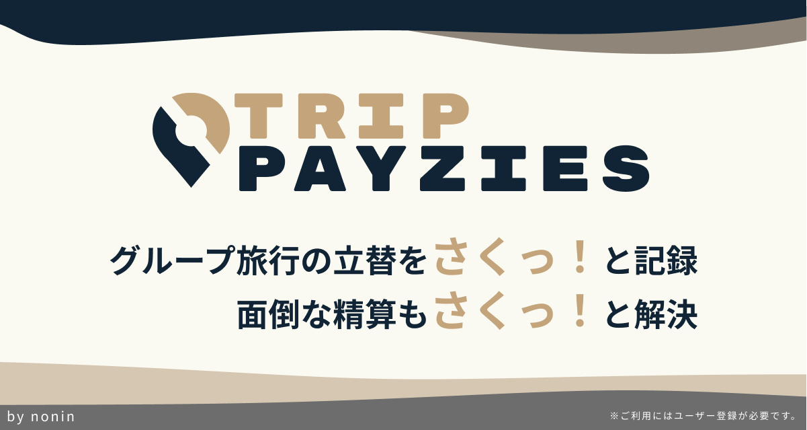

# TripPayzies

###  サービスURL：<a href="https://www.trippayzies.com/" target="_blank">trippayzies.com</a>

## 目次
- [サービス概要](#概要)
- [サービスへの思い](#サービスへの思い)
- [機能一覧](#機能一覧)
- [アプリ画面](#アプリ画面)
- [使用技術](#使用技術)
- [画面遷移図](#画面遷移図)
- [ER図](#er図)

## 概要

グループ旅行における立替や割り勘の記録・精算を効率化するWebアプリです。支払内容と対象者を記録するだけで、**誰が誰にいくら支払うべきか**を自動で算出。手間のかかる精算を簡単・正確にし、旅行をより快適に楽しめるようサポートします。

### 想定ユーザー

 **大学生〜20代社会人**
- 旅行頻度が高く、3〜8人程度のグループ旅行をする機会が多いため

### 利用の流れ

1. 旅行とメンバー情報を登録  
2. 誰かが立て替えたら、その場でアプリに記録  
3. 負担状況がグラフで可視化  
4. 最終日に、アプリが**誰が誰にいくら払うべきか**を自動で提示  
5. アプリに沿って簡単に精算完了！

---

## 開発の背景

### なぜこのサービスを作ったのか

大学時代、友人との旅行で**精算の煩雑さ**を何度も感じました。ホテルやレンタカーの予約で私が代表して全員分を支払うことが多く、その後も他のメンバーが個別に立て替えるなど、支払いの整理が難しくなりがちでした。結果として、旅行の終盤には「結局、誰がいくら払えばいいの？」という状況に。せっかくの楽しい時間が、最後に**余計な手間とストレス**で締めくくられるのがもったいないと感じていました。このような経験から、**旅行中の支払いをスムーズに管理し、全員が気持ちよく旅を終えられる仕組み**を作りたいと思い、アプリ開発を決意しました。

---

## 推しポイント・他サービスとの違い

既存の精算アプリでは、最終的な「誰が誰にいくら払うか」だけが表示され、**その金額の根拠がわかりにくい**と感じることが多くありました。実際の旅行でも、「本当にその金額合ってるの？」「なんで○○は払わなくていいの？」といった疑問が生まれ、**全員が納得して精算を終えるのが難しい**場面も少なくありませんでした。
そこでこのアプリでは、以下の点を工夫しています：
- **支払い履歴・立替状況をグラフで視覚的に表示**し、ロジックを直感的に理解できる  
- **UIデザインにこだわり、誰でも簡単に使える操作性**

これにより、「納得感のある精算」と「旅行後の気持ちよい解散」を実現しています。

## 機能一覧

### ◼︎ MVP機能一覧

#### ➤ ユーザー機能
- ユーザー登録
- ログイン・ログアウト

#### ➤ 旅行機能
- **旅行作成**
  - 設定項目: [旅行名・出発日・参加者]
  - 参加者を最大10人まで一括作成可能
- **旅行編集**
  - 参加者を除く情報[旅行名・出発日]を編集可能

#### ➤ 立替機能
- **立替作成 & 編集**
  - 設定項目: [項目名・決済者・金額・決済日・場所・メモ・対象者]
  - 決済者は1人を選択し、対象者はチェックボックスで複数選択可

#### ➤ 精算機能
- **精算結果表示**
  - 誰が誰にいくら払うかを自動計算して表示
- **精算状況変更**
  - 旅行ごとに「精算済み」「未精算」を切り替え可能

### ◼︎ 本リリース時追加機能

#### ➤ 旅行検索機能
- 旅行名・精算状況による絞り込み検索

#### ➤ グループ機能
- **グループ作成 & 編集**
  - よく一緒に旅行するメンバーをプリセットとして登録
  - 設定項目: [グループ名・アイコン・メンバー]
- **グループ選択**
  - 旅行作成 & 編集時にグループを選択可能
  - 選択すると旅行参加者にグループメンバーが自動で追加
  - 旅行参加者は追加で編集可能

#### ➤ 外貨立替機能
- CurrencyAPIで為替レートを毎日記録 
- 53通貨から選択可能
- 日本円または旅行に設定した通貨で立替を記録可能 
- 決済日の為替レートを使用して立替記録単位で日本円に自動換算

#### ➤ 分析・可視化機能
- 旅行代金表示
- 貸借差額グラフの表示
- 決済額グラフの表示

#### ➤ 共有機能
- 共有リンクで旅行メンバーに旅行記録を共有可能（未ログインで閲覧可）

#### ➤ Googleログイン認証

#### ➤ ダークモード
- サイドバーから切り替え可能

#### ➤ その他
- 利用規約
- プライバシーポリシー
- お問い合わせ

## アプリ画面
| 旅行詳細 | 立替詳細 | 精算結果 | 分析 |
| :---: | :---: | :---: | :---: |
|  |  |  |  |

| 旅行作成 | 立替作成 |
| :---: | :---: |
| 

 | 

 |
| 
グループを選択すると参加者が自動で追加されます。作成時であれば追加の編集も可能です。
 | 
旅行に設定した外貨または日本円で立替記録が可能です。決済日前日23:59の為替レートをもとに日本円に換算されます。
 |

## 使用技術
| カテゴリ | 技術構成 |
|-|-|
| フロントエンド | Stimulus / Turbo / Tailwind CSS |
| バックエンド | Ruby 3.3.6 / Ruby on Rails 7.2.2 |
| データベース | PostgreSQL |
| 認証 | Devise / Omniauth（Google OAuth対応）|
| 環境構築 | Docker / Docker Compose / dotenv-rails |
| CI/CD | GitHub Actions (RuboCop / RSpec(Coverage75%) / Brakeman) |
| インフラ | Render |
| 画像処理 | CarrierWave / MiniMagick / Amazon S3 |
| UX/検索・可視化 | Ransack / Chart.js |
| 為替API | CurrencyAPI |
| 定期実行 | Google Apps Script |
| 管理画面 | Administrate |
| バージョン管理 | GitHub |

## 画面遷移図
https://www.figma.com/design/8JN7kY58d5PfqbbzSJ2daH/trip-payzies-MVP-%E7%94%BB%E9%9D%A2%E9%81%B7%E7%A7%BB%E5%9B%B3?node-id=60-120&t=4tpTDsk7LH8kXuK9-1

## ER図

